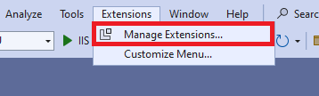
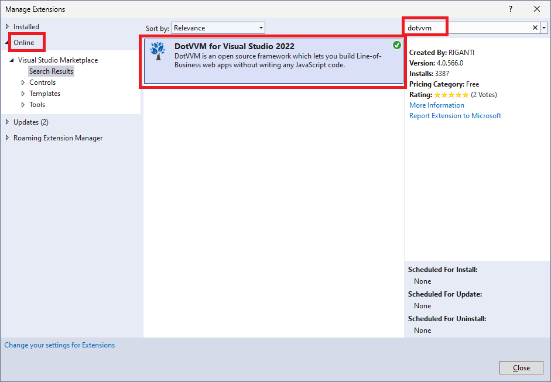
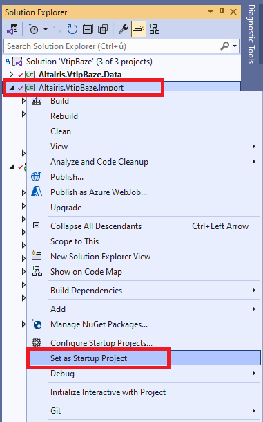
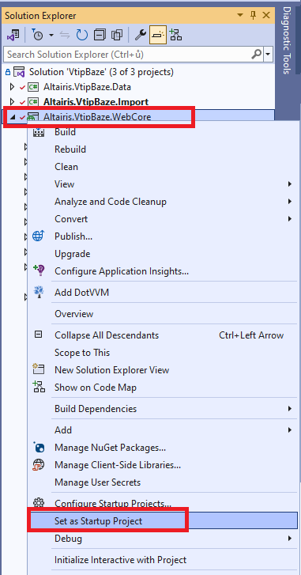
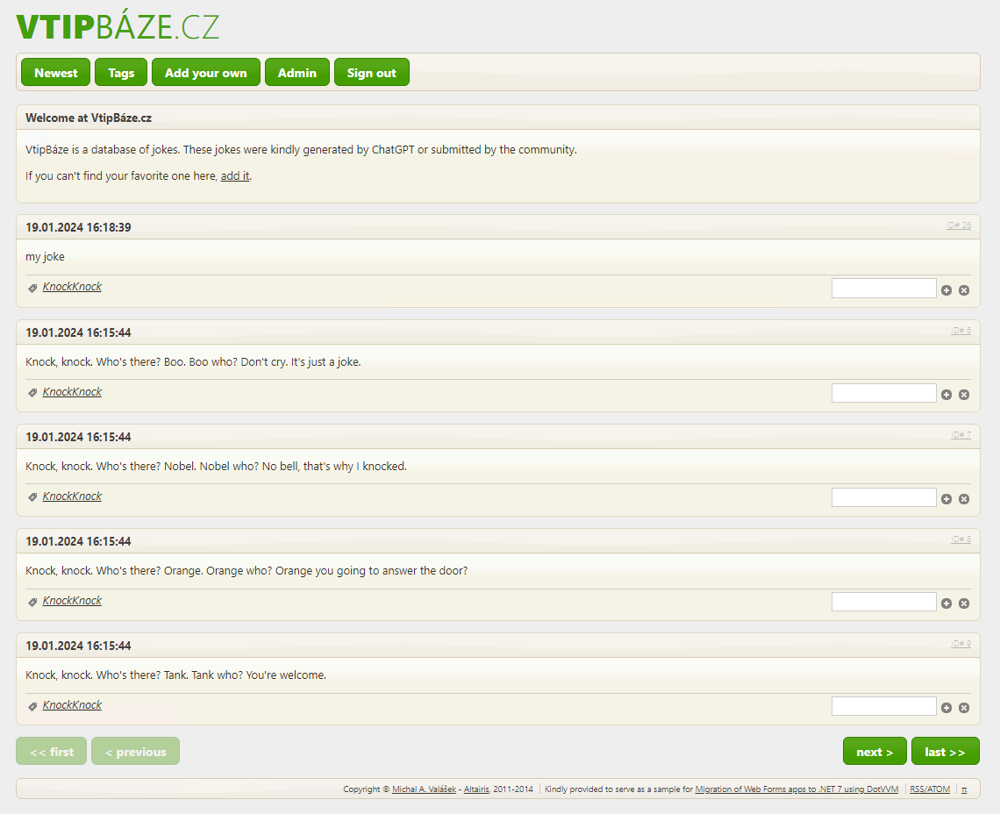

# Running the original .NET Framework application locally

## Install DotVVM extension

1. Make sure you have installed the latest updates of **Visual Studio 2022**.

1. Install [DotVVM for Visual Studio 2022](https://www.dotvvm.com/get-dotvvm) extension by searching for `dotvvm` in the _Extensions > Manage Extensions_ menu. 

	

	

1. Restart Visual Studio to install the extension.

## Prepare the database

1. Clone this repository in Visual Studio.

1. Make sure you are switched in the `main` branch.

1. Open the solution `src\VtipBaze.sln`.

	> If Visual Studio asks to upgrade the projects to a higher version of .NET Framework because of missing targeting packs, select _Yes_. We will need to upgrad all projects to .NET Framework 4.7.2 or newer version during the proces anyway. 

1. Open the `App.config` file located in the `Altairis.VtipBaze.Import` project.

1. Update the connection string to point to the database. If the database with the specified name does not exist, it will be created automatically.

	> Caution: It needs to be changed on 3 places - lines 7, 8 and 16 (without the specification of the database).
	>
	> **For SQL Server Express:** keep the connection strings as they are
	>
	> **For SQL LocalDB:**
	> 
	> lines 7 & 8: `Data Source=(localdb)\MsSqlLocalDb; Initial Catalog=VtipBaze-old; Integrated Security=true; MultipleActiveResultSets=True`
	>
	> line 16: `Data Source=(localdb)\MsSqlLocalDb; Integrated Security=true; MultipleActiveResultSets=True` 

1. Set the `Altairis.VtipBaze.Import` project as the startup project.

	

1. Run the project by pressing F5. It will initialize the database.

	> If the tool ends without printing out anything, it means that the database was created successfully.
	>
	> If Visual Studio stops on an error, the connection string is probably incorrect.

1. Open the `Web.config` file located in the `Altairis.VtipBaze.WebCore` project.

1. Update the connection string to point to the database. If the database with the specified name does not exist, it will be created automatically.

	> Caution: It needs to be changed on 3 places - lines 7, 8 and 70 (without the specification of the database).
	>
	> **For SQL Server Express:** keep the connection strings as they are
	>
	> **For SQL LocalDB:**
	> 
	> lines 7 & 8: `Data Source=(localdb)\MsSqlLocalDb; Initial Catalog=VtipBaze-old; Integrated Security=true; MultipleActiveResultSets=True`
	>
	> line 70: `Data Source=(localdb)\MsSqlLocalDb; Integrated Security=true; MultipleActiveResultSets=True` 

1. Make sure the folder `C:\temp\mailpickup` exists. When the application needs to send an e-mail, it generates a file in this folder instead.

## Run the project

1. Set the `Altairis.VtipBaze.WebCore` project as the startup project.

	

1. Run the project by pressing F5.

1. Make sure that the home page displays some jokes.

1. Make sure the **Tags** button on the top displays the categories of jokes.

1. Try to submit a joke on the **Add your own** page.

1. Look in the `c:\temp\mailpickup` folder if a file with the outgoing e-mail was generated.

1. Try to sign in into the application. Locate the **π** symbol in the page footer, and use `admin` and `admin123` as user credentials.

1. Try to assign the submitted joke in some category (for example _KnockKnock_) and approve it.

1. Visit the home page again to see whether the joke appears in the list.

	