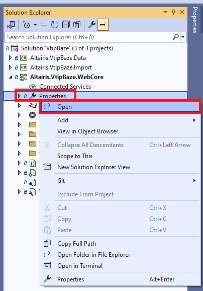

# Installing DotVVM in the project

> The `main` branch contains the project **before** applying the following steps.
>
> The `step01` shows how the project looks like **after** applying the following steps.

## Installing DotVVM extension

1. Make sure you have installed the latest updates of **Visual Studio 2022**.

1. Install [DotVVM for Visual Studio 2022](https://www.dotvvm.com/get-dotvvm) extension by searching for `dotvvm` in the _Manage Extensions_ window. 

1. Restart Visual Studio to install the extension.

## Adding DotVVM package

1. Upgrade all projects in the solution to **.NET Framework 4.7.2** or newer.

    

    

    > Perform these steps for all three projects in the solution.

1. Make sure the solution can be built without errors.

1. Right-click on the `Altairis.VtipBaze.WebCore` package and select **Add DotVVM**.

    

1. Confirm the changes and wait for the process to complete. 

    

    

1. Finally, right-click the project and select **Manage NuGet Packages**. We will need to add the `DotVVM.Adapters.WebForms` package manually.

    

1. In the package manager window, search for `DotVVM.Adapters.WebForms` package and install it in the project.

    

1. Open the `DotvvmStartup.cs` file and add the following line in the `Configure` method:

    ```diff
     public void Configure(DotvvmConfiguration config, string applicationPath)
     {
    +    config.AddWebFormsAdapters();
    +
         ConfigureRoutes(config, applicationPath);
         ConfigureControls(config, applicationPath);
         ConfigureResources(config, applicationPath);
     }    
    ```

> After this step, the application will still be using ASP.NET Web Forms, but you may use DotVVM pages in the project as well.