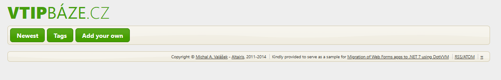

# Migrate first DotVVM page

> The `step01` branch contains the project **before** applying the following steps.
>
> The `step02` shows how the project looks like **after** applying the following steps.

## Creating a master page

Because the original application contains ASP.NET Web Forms Master page, it is a good idea to start by migrating the master page first.

1. Right-click on the `Views` folder in the project and select **Add > New Item...**. 

    

1. Select **DotVVM Master Page** item and name it `Site.dotmaster`. 

    > If you can see just a small window where you enter the file name, click on the _Show All Templates_ button to display the full experience.

    

1. Confirm the next window to create the viewmodel for the page automatically.

    

## Converting ASP.NET Web Forms master page syntax to DotVVM

In this section, we will take the original Web Forms pages from the `Pages` folder and we will create their equivalents in the `Views` and `ViewModels` folder using the DotVVM. 

All pages in the `Pages` folder should remain unchanged - we will remove them in the later stages of the migration.

1. Open the [ASPX to DotVVM converter](https://www.dotvvm.com/webforms/convert) and paste the source code of the `Altairis.VtipBaze.WebCore/Pages/Site.Master` in the text box.

1. Click on the **Continue** button at the bottom of the page. It will provide suggestions for the most typical syntax changes.

    

1. Click on all four **Apply All Fixes** buttons.

    > * The first fix will remove all `runat="server"` because it is not needed in DotVVM.
    > * The second fix will change `<asp:HyperLink>` controls to `<webforms:HybridRouteLink>` controls.
    > * The third fix will parse the binding expressions representing the route URL and convert them to the DotVVM syntax:
    >
    >    `<... NavigateUrl='<%$ RouteUrl: RouteName=HomePage, PageIndex=1 %>' ...>`
    >
    >    will become
    >
    >    `<... RouteName="HomePage" Param-PageIndex="1" ...>`
    > * The fourth fix will change `<asp:LoginView>` to `<dot:AuthenticatedView>`.
    > * The fifth fiw will change the `<LoggedInTemplate>` to `<AuthenticatedTemplate>`.
    > * The sixth fix will change `<asp:ContentPlaceHolder>` to `<dot:ContentPlaceHolder>`
    
    > _See [ASPX to DotVVM Cheat-sheet](https://www.dotvvm.com/webforms) for more information about the differences between DotVVM and ASP.NET Web Forms markup._

1. Finally, paste the modified code to the `Views/Site.dotmaster` file (replace all its original content).

## Manual changes in the markup

Unfortunately, the converter is not able to perform all the changes. Some fixes should be done by hand.

1. The page head section contains shims for IE9 and a reference to jQuery UI theme which is not used any more. Also, we will not use the System.Web optimization function to generate minified styles. 

   However, we will reference the scripts and styles of the site using the DotVVM `<dot:RequiredResource>` control.

   Change the beginning of the page (everything until the `</head>` element) like this:

    ```diff
    + @viewModel Altairis.VtipBaze.WebCore.ViewModels.SiteViewModel, Altairis.VtipBaze.WebCore
    +
     <!DOCTYPE html>
    -<%@ Master Language="C#" AutoEventWireup="true" CodeBehind="Site.master.cs"  Inherits="Altairis.VtipBaze.WebCore.Pages.Site" ViewStateMode="Disabled" %>
     <html xmlns="http://www.w3.org/1999/xhtml">
     <head>
    -    <title></title>
    +    <title>{{value: PageTitle}}</title>
    -    <!--[if lt IE 9]><script src="//html5shiv.googlecode.com/svn/trunk/html5.js"></script><![endif]-->
    -    <link rel="stylesheet" type="text/css" href="//ajax.aspnetcdn.com/ajax/jquery.ui/1.10.3/themes/south-street/jquery-ui.css" />
    -    <asp:PlaceHolder runat="server">
    -        <%: System.Web.Optimization.Styles.Render("~/Styles/css") %>
    -    </asp:PlaceHolder>
    +    <meta charset="utf-8" />

         <link rel="alternate" type="application/atom+xml" href="/feed.xml" />
         <meta name="author" content="Michal A. Valášek (www.rider.cz), Altairis (www.altairis.cz)" />
         <meta name="description" content="Ad-free database of jokes" />
    +
    +    <dot:RequiredResource Name="site" />
    +    <dot:RequiredResource Name="site-css" />
     </head>
    ```

    After performing the changes, the page header should look like this:

    ```html
    @viewModel Altairis.VtipBaze.WebCore.ViewModels.SiteViewModel, Altairis.VtipBaze.WebCore

    <!DOCTYPE html>
    <html xmlns="http://www.w3.org/1999/xhtml">
    <head>
        <title>{{value: PageTitle}}</title>
        <meta charset="utf-8" />

        <link rel="alternate" type="application/atom+xml" href="/feed.xml" />
        <meta name="author" content="Michal A. Valášek (www.rider.cz), Altairis (www.altairis.cz)" />
        <meta name="description" content="Ad-free database of jokes" />
            
        <dot:RequiredResource Name="site" />    
        <dot:RequiredResource Name="site-css" />
    </head>
    ```

1. In the body part of the master page, we also need to make some changes.

    DotVVM does not need the `<form>` element and the `<asp:ScriptManager>` control. Let's remove them:

    ```diff
     ...
     </head>
     <body>
    -    <form id="form1">
    -        <asp:ScriptManager EnableCdn="true" AjaxFrameworkMode="Disabled">
    -            <Scripts>
    -                <asp:ScriptReference Name="jquery" />
    -                <asp:ScriptReference Name="jquery.ui.combined" />
    -                <asp:ScriptReference Name="site" />
    -            </Scripts>
    -        </asp:ScriptManager>
             <header>
                 ...
             </footer>
    -    </form>
    </body>
    </html>
    ```

1. Additionally, there is the `<asp:LoginStatus>` component which generates the Sign Out link. Unfortunately, it is not supported in DotVVM - we need to replace it with a `<dot:LinkButton>` and implement its logic ourselves:

    ```diff
    - <asp:LoginStatus LogoutText="Sign out" data-confirmprompt="Do you really want to sign out?" />
    + <dot:LinkButton Text="Sign out" data-confirmprompt="Do you really want to sign out?"
    +                 Click="{command: SignOut()}"
    +                 Validation.Enabled="false" />
    ```

1. The page now needs the `PageTitle` property to represent the title of the page, and also the sign out button references the `SignOut()` method.

    Open the `SiteViewModel.cs` file in the `ViewModels` folder and update the class to look like this:

    ```csharp
    using DotVVM.Framework.ViewModel;
    using System.Web.Security;

    namespace Altairis.VtipBaze.WebCore.ViewModels
    {
        public abstract class SiteViewModel : DotvvmViewModelBase
        {
            public abstract string PageTitle { get; }

            public void SignOut()
            {
                FormsAuthentication.SignOut();
                Context.RedirectToLocalUrl("/");
            }
        }
    }
    ```

1. The page also requested the resources `site` and `site-css` in the header using the `<dot:RequiredResource>`. We need to tell DotVVM how to find these resources and what do they depend on.

    Open the `DotvvmStartup.cs` file and update the `ConfigureResources` method like this:

    ```diff
     private void ConfigureResources(DotvvmConfiguration config, string applicationPath)
     {
         // register custom resources and adjust paths to the built-in resources
    +     config.Resources.RegisterStylesheetUrl("jquery-ui-css", "https://ajax.aspnetcdn.com/ajax/jquery.ui/1.10.3/themes/south-street/jquery-ui.css", null);
    +     config.Resources.RegisterStylesheetFile("site-css", "Styles/main.min.css", dependencies: new[] { "jquery-ui-css" });
    +
    +     config.Resources.RegisterScriptFile("site", "Scripts/Site/ui.js", dependencies: new[] { "jquery-ui" });
    +     config.Resources.RegisterScriptFile("jquery-ui", "Scripts/jquery-ui-1.10.3.min.js", dependencies: new[] { "jquery" });
    +     config.Resources.RegisterScriptFile("jquery", "Scripts/jquery-2.0.3.min.js");
     }    
    ```

    > This code builds a chain of dependencies:
    > ```
    > site-css          # the main CSS of the site
    >   jquery-ui-css   # jQuery UI CSS theme
    >
    > site              # the main JavaScript of the site
    >   jquery-ui       # jQuery UI scripts
    >     jquery        # jQuery scripts
    > ```
    > By requesting the resources `site` and `site-css` int the page, DotVVM will also include all their dependencies and make sure all `<script>` and `<link>` elements are rendered in the correct order.

1. Save the page and try to build the project. There should be no errors.

## Adding a test page to make sure the master page works

Now all our edits are finished. Let's start with adding the first page to make sure the master page works.

1. Make sure the master page is saved. To be sure, press Ctrl-Alt-S. 

1. Right-click on the `Views` folder and select **Add > New Item...**.

1. Choose **DotVVM Page** and name it `TagList.dothtml`. 

    

1. Let DotVVM create the viewmodel for the page and have it embeded in our master page.

    

1. Open the `ViewModels/TagListViewModel.cs` and add the implementation of the abstract `PageTitle` property:

    ```diff
     public class TagListViewModel : SiteViewModel
     {
    +     public override string PageTitle => "Categories";
     }
    ```

1. Run the project and navigate to the `/TagList` page.

    > The page should show have any content, but it will be using the same styles and the same layout. 
    
    

    > Notice that the original `TagList.aspx` page is still functional - it is configured for the `/tags` URL. 
    > 
    > In the next step, we will update DotVVM route table to use the same URL.
