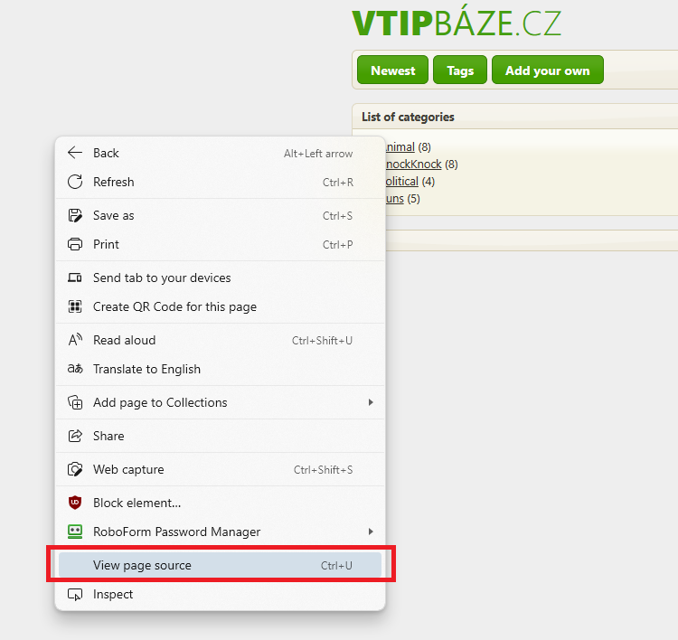
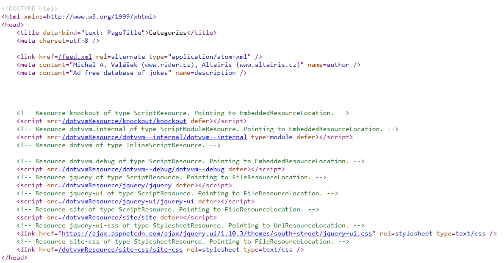

# Migrate other pages

> The `step02` branch contains the project **before** applying the following steps.
>
> The `step03` shows how the project looks like **after** applying the following steps.

## Converting and editing the TagList page

1. Load the markup of the page `Pages/TagList.aspx` in the [ASPX to DotVVM converter](https://www.dotvvm.com/webforms/convert) and apply all the fixes.

1. Paste the code to the `Views/TagList.dothtml` file (ignore the first row with the ASP.NET Web Forms directive, and keep the first two lines in the DotHTML file). 

    After reformatting, the code should look like this:

    ```html
    @viewModel Altairis.VtipBaze.WebCore.ViewModels.TagListViewModel, Altairis.VtipBaze.WebCore
    @masterPage Views/Site.dotmaster

    <dot:Content ID="Content1" ContentPlaceHolderID="MainCPH">
        <article>
            <header>
                List of categories
            </header>
            <ul class="taglist">
                <dot:Repeater ItemType="Altairis.VtipBaze.Data.Tag" SelectMethod="SelectTags">
                    <ItemTemplate>
                        <li>
                            <span class="ui-icon ui-icon-tag"></span>
                            <a Text="{value: Item.TagName}" href="{value: this.GetRouteUrl("TagSearch", new { TagName = Item.TagName })}" />
                            <%# string.Format("({0})",  Item.Jokes.Count) %>
                        </li>
                    </ItemTemplate>
                </dot:Repeater>
            </ul>
        </article>
    </dot:Content>
    ```

1. The `<dot:Repeater>` control needs a few manual edits. In DotVVM, we need to have properties in the viewmodel for all data-bound controls. 

    Add the following property to the `ViewModels/TagListViewModel.cs`:

    ```csharp
    public List<TagListModel> Tags { get; set; }
    ```

1. We also need to declare the `TagListModel` class. Add a folder called `Model` in the project, and place this code in the `Model/TagListViewModel.cs` file:

    ```csharp
    namespace Altairis.VtipBaze.WebCore.Model
    {
        public class TagListModel
        {
            public string TagName { get; set; }
            public int JokesCount { get; set; }
        }
    }
    ```

1. Then change the `<dot:Repeater>` to bind to this collection. We can also merge it with its parent element.

    ```diff
    -<ul class="taglist">
    -    <dot:Repeater ItemType="Altairis.VtipBaze.Data.Tag" SelectMethod="SelectTags">
    +<dot:Repeater DataSource="{value: Tags}" WrapperTagName="ul" class="taglist">
       ...
    +</dot:Repeater>
    -    </dot:Repeater>
    -</ul>
    ```

1. The hyperlink control can be changed to `<webforms:HybridRouteLink>`.

    ```diff
    -<a Text="{value: Item.TagName}" 
    -   href="{value: this.GetRouteUrl("TagSearch", new { TagName = Item.TagName })}" />
    +<webforms:HybridRouteLink RouteName="TagSearch" 
    +                          Param-TagName="{value: TagName}" 
    +                          Text="{value: TagName}" />
    ```

1. The remaining binding expression needs to be changed manually too:

    ```diff
    -<%# string.Format("({0})",  Item.Jokes.Count) %>
    +{{value: $"({JokesCount})"}}
    ```

The final markup of the page should look like this:

```html
@viewModel Altairis.VtipBaze.WebCore.ViewModels.TagListViewModel, Altairis.VtipBaze.WebCore
@masterPage Views/Site.dotmaster

<dot:Content ContentPlaceHolderID="MainCPH">
    <article>
        <header>
            List of categories
        </header>
        <dot:Repeater DataSource="{value: Tags}" WrapperTagName="ul" class="taglist">
            <li>
                <span class="ui-icon ui-icon-tag"></span>
                <webforms:HybridRouteLink RouteName="TagSearch" 
                                          Param-TagName="{value: TagName}" 
                                          Text="{value: TagName}" />
                {{value: $"({JokesCount})"}}
            </li>
        </dot:Repeater>
    </article>
</dot:Content>
```

## Refactoring the page viewmodel

To make the page work, we need to fill the `Tags` collection we added to the viewmodel.

1. The ASP.NET Web Forms code-behind file currently looks like this:

    ```csharp
    public partial class TagList : System.Web.UI.Page
    {
        VtipBazeContext DataContext = new VtipBazeContext();

        protected void Page_Load(object sender, EventArgs e)
        {

        }

        public IQueryable<Tag> SelectTags()
        {
            return this.DataContext.Tags.OrderBy(x => x.TagName);
        }
    }
    ```

1. First, let's copy the `SelectTags` method in the viewmodel, and have the `VtipBazeContext` injected using dependency injection as the parameter constructor:

    ```diff
     using System;
     using System.Collections.Generic;
     using System.Linq;
     using System.Text;
     using System.Threading.Tasks;
     using DotVVM.Framework.ViewModel;
     using DotVVM.Framework.Hosting;
     using Altairis.VtipBaze.WebCore.Model;
     using Altairis.VtipBaze.Data;

     namespace Altairis.VtipBaze.WebCore.ViewModels
     {
         public class TagListViewModel : SiteViewModel
         {
    +        private readonly VtipBazeContext dbContext;
 
             public List<TagListModel> Tags { get; set; }
 
             public override string PageTitle => "Categories";
 
    +        public TagListViewModel(VtipBazeContext dbContext)
    +        {
    +            this.dbContext = dbContext;
    +        }

    +        public IQueryable<Tag> SelectTags()
    +        {
    +            return dbContext.Tags.OrderBy(x => x.TagName);
    +        }
         }
     }    
    ```

1. Now we need to update the `SelectTags` method to not return the Entity Framework entities, but to use the `TagListModel` class:

    ```diff
    -public IQueryable<Tag> SelectTags()
    +public IQueryable<TagListModel> SelectTags()
     {
         return dbContext.Tags
             .OrderBy(x => x.TagName)
    +        .Select(x => new TagListModel()
    +        {
    +            TagName = x.TagName,
    +            JokesCount = x.Jokes.Count
    +        });
     }
    ```

1. Finally, add the `PreRender` method that loads the data in the `Tags` collection:

    ```csharp
    public override Task PreRender()
    {
        Tags = SelectTags().ToList();
        return base.PreRender();
    }    
    ```

The viewmodel now should look like this:

```csharp
using System;
using System.Collections.Generic;
using System.Linq;
using System.Text;
using System.Threading.Tasks;
using DotVVM.Framework.ViewModel;
using DotVVM.Framework.Hosting;
using Altairis.VtipBaze.WebCore.Model;
using Altairis.VtipBaze.Data;

namespace Altairis.VtipBaze.WebCore.ViewModels
{
    public class TagListViewModel : SiteViewModel
    {
        private readonly VtipBazeContext dbContext;

        public List<TagListModel> Tags { get; set; }

        public override string PageTitle => "Categories";

        public TagListViewModel(VtipBazeContext dbContext)
        {
            this.dbContext = dbContext;
        }

        public override Task PreRender()
        {
            Tags = SelectTags().ToList();

            return base.PreRender();
        }

        public IQueryable<TagListModel> SelectTags()
        {
            return dbContext.Tags
                .OrderBy(x => x.TagName)
                .Select(x => new TagListModel()
                {
                    TagName = x.TagName,
                    JokesCount = x.Jokes.Count
                });
        }
    }
}
```

## Finishing touches

1. Open the `DotvvmStartup.cs` file and add the following line to the `ConfigureServices` method to set up the `VtipBazeContext` class for the dependency injection.

    ```diff   
     public void ConfigureServices(IDotvvmServiceCollection options)
     {
         options.AddDefaultTempStorages("temp");
    +    options.Services.AddScoped<VtipBazeContext>();
     }
    ```

1. Remove the default routing strategy and register the `TagList` page manually in the `ConfigureRoutes` method:

    ```diff
     private void ConfigureRoutes(DotvvmConfiguration config, string applicationPath)
     {
         // register routes   
    -     config.RouteTable.AutoDiscoverRoutes(new DefaultRouteStrategy(config));
    +     config.RouteTable.Add("TagList", "tags", "Views/TagList.dothtml");  
     }
    ```

If you run the application and click on the **Tags** button in the menu, the Tag List page will appear. 

> If you check the source code of the page in the browser, you will see that the HTML markup does not contain the ViewState field. DotVVM renders a different output, but because of the same CSS styles, the users will not be able to tell the difference.




