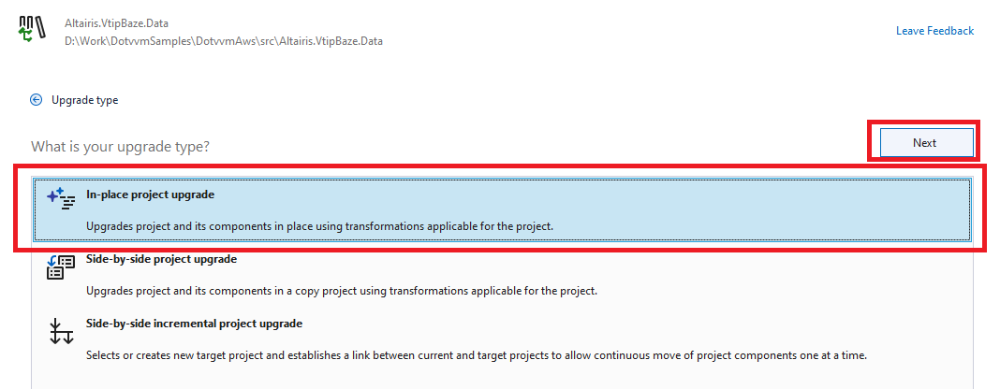

# Switching the database to the new .NET

> The `step04` branch contains the project **before** applying the following steps.
>
> The `step05` shows how the project looks like **after** applying the following steps.

Now, we have reached to the point when all ASP.NET Web Forms pages are rewritten into DotVVM. 

We need to deal with the last obstacle - the application uses the old ASP.NET Universal Providers to store the user accounts in the database.

> In this tutorial, we will migrate just 2 out of 3 projects. 
>
> After performing all the steps, the web application will be temporarily non-compilable as it still targets .NET Framework 4.8. We will finish this in the next tutorial.

## Migrating to Entity Framework Core and ASP.NET Core Identity

1. Make sure you have installed the [.NET Migration Assistant](https://learn.microsoft.com/en-us/dotnet/core/porting/upgrade-assistant-install) extension.

1. Right-click the `Altairis.VtipBaze.Data` project and select **Upgrade**.

    

1. Select **In-place project upgrade**.

    

1. Select **.NET 8** as the target framework.

    

1. Proceed with the selection and wait until the project is upgraded.

1. Delete the `Properties` folder and `App.config` files. They are not needed any more.

1. Double-click the `Altairis.VtipBaze.Data` project to view the project file.

1. Change the _Entity Framework 6_ NuGet package to _Entity Framework Core_, and add the _ASP.NET Core Identity_ package.

    ```diff
     <Project Sdk="Microsoft.NET.Sdk">
         <PropertyGroup>
             <TargetFramework>net8.0</TargetFramework>
             <OutputType>Library</OutputType>
             <GenerateAssemblyInfo>false</GenerateAssemblyInfo>
         </PropertyGroup>
         <ItemGroup>
             <PackageReference Include="Microsoft.CSharp" Version="4.7.0" />
             <PackageReference Include="System.ComponentModel.Annotations" Version="5.0.0" />
             <PackageReference Include="System.Data.DataSetExtensions" Version="4.5.0" />
    -        <PackageReference Include="EntityFramework" Version="6.4.4" />
    +        <PackageReference Include="Microsoft.AspNetCore.Identity.EntityFrameworkCore" Version="8.0.0" />
    +        <PackageReference Include="Microsoft.EntityFrameworkCore.Design" Version="8.0.0">
    +          <PrivateAssets>all</PrivateAssets>
    +          <IncludeAssets>runtime; build; native; contentfiles; analyzers; buildtransitive</IncludeAssets>
    +        </PackageReference>
    +        <PackageReference Include="Microsoft.EntityFrameworkCore.SqlServer" Version="8.0.0" />
    +        <PackageReference Include="Microsoft.EntityFrameworkCore.Tools" Version="8.0.0">
    +          <PrivateAssets>all</PrivateAssets>
    +          <IncludeAssets>runtime; build; native; contentfiles; analyzers; buildtransitive</IncludeAssets>
    +        </PackageReference>
         </ItemGroup>
         <PropertyGroup>
             <AssemblyTitle>Altairis VtipBaze DAL</AssemblyTitle>
             <Company>Altairis, s. r. o.</Company>
             <Product>Altairis VtipBaze</Product>
             <Copyright>Copyright © Michal A. Valasek - Altairis, 2011</Copyright>
             <AssemblyVersion>1.0.%2a</AssemblyVersion>
             <FileVersion>1.0.0.0</FileVersion>
         </PropertyGroup>
     </Project>
    ```

1. We need to add support for ASP.NET Core Identity to the `VtipBazeContext`.

    ```diff
     using System;
     using System.Collections.Generic;
    -using System.Data.Entity;
     using System.Linq;
     using System.Text;
     using System.Threading.Tasks;
    +using Microsoft.AspNetCore.Identity.EntityFrameworkCore;
    +using Microsoft.EntityFrameworkCore;

     namespace Altairis.VtipBaze.Data
     {
    -    public class VtipBazeContext : DbContext
    +    public class VtipBazeContext : IdentityDbContext
         {

             public DbSet<Joke> Jokes { get; set; }

             public DbSet<Tag> Tags { get; set; }

         }
     }
    ```

1. We also need to add the required constructors for _Entity Framework Core_, specify the default connection string for migrations, and configure the names of M:N relationship tables so they would map to the tables we already have in the database. 

    ```diff
     public class VtipBazeContext : IdentityDbContext
     {
        ...

    +    public VtipBazeContext()
    +    {
    +    }
    +
    +    public VtipBazeContext(DbContextOptions options) : base(options)
    +    {
    +    }
    +
    +    protected override void OnConfiguring(DbContextOptionsBuilder optionsBuilder)
    +    {
    +        if (!optionsBuilder.IsConfigured)
    +        {
    +            optionsBuilder.UseSqlServer("Data Source=.\\SQLEXPRESS; Integrated Security=True; Initial Catalog=VtipBaze; MultipleActiveResultSets=True; Trust Server Certificate=true");
    +        }
    +        base.OnConfiguring(optionsBuilder);
    +    }
    +
    +    protected override void OnModelCreating(ModelBuilder builder)
    +    {
    +        builder.Entity<Joke>()
    +            .HasMany(j => j.Tags)
    +            .WithMany(t => t.Jokes)
    +            .UsingEntity<Dictionary<string, object>>(
    +                "TagJokes",
    +                b => b.HasOne<Tag>().WithMany().HasForeignKey("Tag_TagName"),
    +                b => b.HasOne<Joke>().WithMany().HasForeignKey("Joke_JokeId"));
    +
    +        base.OnModelCreating(builder);
    +    }    
    }
    ```

1. Now, we want to create a migration to add the ASP.NET Core Identity tables in the database.

    Open the **Package Manager Console** pane and run the following command:

    ```
    Add-Migration AspNetIdentityTables -Project Altairis.VtipBaze.Data -StartupProject Altairis.VtipBaze.Data
    ```

1. We will need to manually edit the `*_AspNetIdentityTables.cs` migration as it creates also the tables we already have in the database:

    ```diff
    ...
     public partial class AspNetIdentityTables : Migration
     {
         /// <inheritdoc />
         protected override void Up(MigrationBuilder migrationBuilder)
         {            
     ...
    -        migrationBuilder.CreateTable(
    -            name: "Jokes",
    -            ...
    -
    -        migrationBuilder.CreateTable(
    -            name: "Tags",
    -            ...

     ...

    -        migrationBuilder.CreateTable(
    -            name: "TagJokes",
    -            ...

     ...

    -        migrationBuilder.CreateIndex(
    -            name: "IX_TagJokes_Tag_TagName",
    -            table: "TagJokes",
    -            column: "Tag_TagName");
         }

         /// <inheritdoc />
         protected override void Down(MigrationBuilder migrationBuilder)
         {
             ...

    -        migrationBuilder.DropTable(
    -            name: "TagJokes");

             ...

    -        migrationBuilder.DropTable(
    -           name: "Jokes");
    -
    -        migrationBuilder.DropTable(
    -           name: "Tags");
        }
     }    
    ```

1. In the `VtipBazeContext.cs`, update the connection string to point to your database.

1. Run the following command in **Package Manager Console**:

    ```
    Update-Database -Project Altairis.VtipBaze.Data -StartupProject Altairis.VtipBaze.Data
    ```

1. This migration added the following tables to the database:

    

> The identity tables are empty. It is our responsibility to migrate all the users to the new database structure.
>
> ASP.NET Core Identity uses a different method for hashing the passwords. In real-world applications, the users will be required to reset their passwords.

## Migrating the database seed tool

1. Use the **.NET Migration Assistant** to upgrade the `Altairis.VtipBaze.Import`  project to **.NET 8*. The process is the same as with the `Altairis.VtipBaze.Data`.

1. Delete the `Properties` folder and `App.config` files. They are not needed any more. 

1. Double-click the `Altairis.VtipBaze.Import` to open the project file. We can remove most package references since they are present in the `Data` project:

    ```diff
     <Project Sdk="Microsoft.NET.Sdk">
         <PropertyGroup>
             <OutputType>Exe</OutputType>
         </PropertyGroup>
         <PropertyGroup>
             <StartupObject>Altairis.VtipBaze.Import.Program</StartupObject>
         </PropertyGroup>
         <PropertyGroup>
             <TargetFramework>net8.0</TargetFramework>
             <GenerateAssemblyInfo>false</GenerateAssemblyInfo>
             <AssemblyTitle>Altairis.VtipBaze.Import</AssemblyTitle>
             <Product>Altairis.VtipBaze.Import</Product>
             <Copyright>Copyright ©  2011</Copyright>
             <AssemblyVersion>1.0.0.0</AssemblyVersion>
             <FileVersion>1.0.0.0</FileVersion>
         </PropertyGroup>
    -    <ItemGroup>
    -        <Reference Include="System.Web" />
    -        <Reference Include="System.Web.ApplicationServices" />
    -    </ItemGroup>
         <ItemGroup>
             <ProjectReference Include="..\Altairis.VtipBaze.Data\Altairis.VtipBaze.Data.csproj" />
         </ItemGroup>
         <ItemGroup>
             <PackageReference Include="ColorCode" Version="1.0.1" />
    -        <PackageReference Include="Microsoft.AspNet.Providers.Core" Version="2.0.0" />
    -        <PackageReference Include="Microsoft.CSharp" Version="4.7.0" />
    -        <PackageReference Include="System.ComponentModel.Annotations" Version="5.0.0" />
    -        <PackageReference Include="System.Data.DataSetExtensions" Version="4.5.0" />
    -        <PackageReference Include="EntityFramework" Version="6.4.4" />
         </ItemGroup>
     </Project>    
    ```

1. Update the `Program.cs` file to work with the new _Entity Framework Core_ API:

    ```diff
     using System;
     using System.Collections.Generic;
     using System.IO;
     using System.Linq;
     using System.Text;
     using System.Threading.Tasks;
    -using System.Web.Security;
     using Altairis.VtipBaze.Data;
    +using Microsoft.AspNetCore.Identity;
    +using Microsoft.Extensions.DependencyInjection;
     
     namespace Altairis.VtipBaze.Import
     {
         class Program
         {
    -        static void Main(string[] args)
    +        static async Task Main(string[] args)
             {
                 using (var dc = new VtipBazeContext())
                 {
    -                dc.Database.CreateIfNotExists();
    +                dc.Database.EnsureCreated();

                    // seed data (all jokes were kindly provided by ChatGPT)
                    if (!dc.Tags.Any())
                    {
     ...
                    }

    +               var services = new ServiceCollection();
    +               services.AddDbContext<VtipBazeContext>();
    +               services.AddIdentityCore<IdentityUser>()
    +                   .AddEntityFrameworkStores<VtipBazeContext>();
    +               var provider = services.BuildServiceProvider();
    +               var userManager = provider.GetRequiredService<UserManager<IdentityUser>>();

    -               var adminUsers = Membership.FindUsersByName("admin");
    -               if (adminUsers.Count == 0)
    -               {
    -                   var user = Membership.CreateUser("admin", "admin123", "test@mail.local");
    -                   user.IsApproved = true;
    -                   Membership.UpdateUser(user);
    +               var adminUser = await userManager.FindByNameAsync("admin");
    +               if (adminUser == null)
    +               {
    +                   var user = new IdentityUser()
    +                   {
    +                      UserName = "admin",
    +                      Email = "test@mail.local",
    +                      SecurityStamp = Guid.NewGuid().ToString()
    +                   };
    +                   await userManager.CreateAsync(user);
    +                   await userManager.AddPasswordAsync(user, "Admin123+");

                        Console.WriteLine("Created admin user.");
                    }
                    else
                    {
                        Console.WriteLine("Admin user already exists, skipped.");
                    }
                }
            } 
        }
    }
    ```

1. Run the tool to seed the admin user in the new database structure by right-clicking the project and selecting **Debug**:

    

