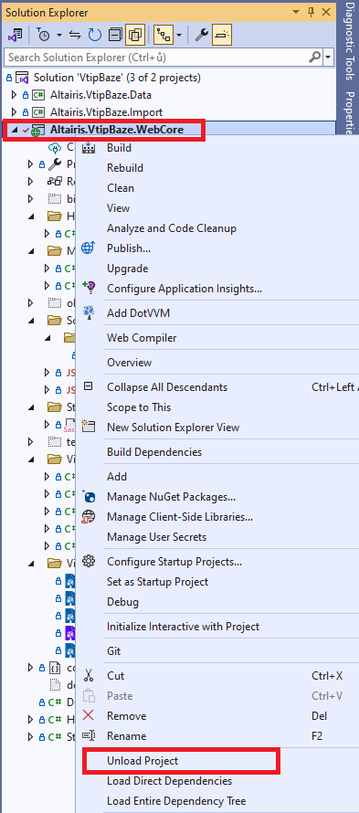
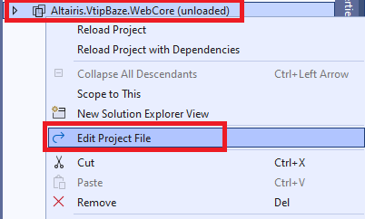
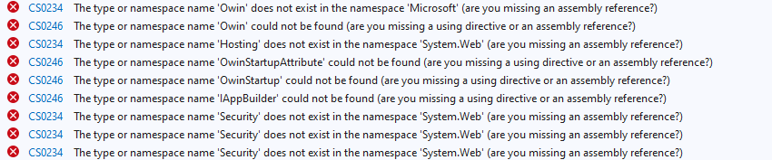

# Switching the web application to the new .NET

> The `step05` branch contains the project **before** applying the following steps.
>
> The `step06` shows how the project looks like **after** applying the following steps.

Everything is now ready to switch the web application to .NET 8.

1. Before switching the project target framework, let's remove all unnecessary files from the `Altairis.VtipBaze.WebCore` project:

    * `Properties/AssemblyInfo.cs` file
    * `App_Themes` folder
    * `Handlers/FeedHandler.cs` file
    * `Handlers/TagListHandler.cs` file
    * `Pages` folder
    * `Scripts/WebForms` folder
    * `Scripts/_references.js` file
    * `Scripts/Web.config` file
    * `Styles/Web.config` file
    * `Global.asax` file
    * `Global.asax.cs` file
    * `packages.config` file
    * `Web.config` file
    * `Web.Debug.config` file
    * `Web.Release.config` file

1. Right-click the project and select **Unload project**:

    

1. Right-click the project again and select **Edit Project File**:

    

1. Remove all contents and paste there the following code snippet:

    ```xml
    <Project Sdk="Microsoft.NET.Sdk.Web">
        <PropertyGroup>
            <TargetFramework>net8.0</TargetFramework>
            <GenerateAssemblyInfo>false</GenerateAssemblyInfo>
            <AssemblyTitle>Altairis VtipBaze DAL</AssemblyTitle>
            <Company>Altairis, s. r. o.</Company>
            <Product>Altairis VtipBaze</Product>
            <Copyright>Copyright © Michal A. Valasek - Altairis, 2011</Copyright>
            <AssemblyVersion>1.0.%2a</AssemblyVersion>
            <FileVersion>1.0.0.0</FileVersion>
        </PropertyGroup>
        <ItemGroup>
            <Content Include="**/*.dothtml;**/*.dotmaster;**/*.dotcontrol" Exclude="obj/**/*.*;bin/**/*.*" CopyToPublishDirectory="Always" />
            <None Remove="**/*.dothtml;**/*.dotmaster;**/*.dotcontrol" />
        </ItemGroup>
        <ItemGroup>
            <None Include="compilerconfig.json" />
            <None Remove="dotvvm_serialized_config.json.tmp" />
        </ItemGroup>
        <ItemGroup>
            <Content Remove="compilerconfig.json" />
        </ItemGroup>
        <ItemGroup>
            <PackageReference Include="DotVVM.Adapters.WebForms" Version="4.2.4" />
            <PackageReference Include="DotVVM.AspNetCore" Version="4.2.4" />
            <PackageReference Include="System.ServiceModel.Syndication" Version="8.0.0" />
        </ItemGroup>
        <ItemGroup>
            <ProjectReference Include="..\Altairis.VtipBaze.Data\Altairis.VtipBaze.Data.csproj" />
        </ItemGroup>
    </Project>
    ```

    > This project file references only the necessary NuGet packages and contains instructions to handle the DotVVM-related files.

1. Right-click on the `Altairis.VtipBaze.WebCore` project and select **Reload project**.

1. Set it again as the startup project.

1. If you try to compile the project, there will still be several errors. 

    

    > There errors are caused by some API changes between ASP.NET and ASP.NET Core.

1. Open the `ViewModels/LoginViewModel.cs` file to change the sign in code.

    Instead of calling `FormsAuthentication.SetAuthCookie`, we will call `signInManager.PasswordSignInAsync`.

    ```diff
     ...
     using System.ComponentModel.DataAnnotations;
    -using System.Web.Security;
    +using Microsoft.AspNetCore.Identity;
     
     namespace Altairis.VtipBaze.WebCore.ViewModels
     {
         public class LoginViewModel : SiteViewModel
         {
    +        private readonly SignInManager<IdentityUser> signInManager;

     ...

    +        [FromQuery("ReturnUrl")]
    +        public string ReturnUrl { get; set; }
    +
    +        public LoginViewModel(SignInManager<IdentityUser> signInManager)
    +        {
    +            this.signInManager = signInManager;
    +        }

    -        public void SignIn()
    +        public async Task SignIn()
             {
    -            if (!Membership.ValidateUser(UserName, Password))
    +            var result = await signInManager.PasswordSignInAsync(UserName, Password, RememberMe, true);
    +            if (!result.Succeeded)
                 {
                     IsError = true;
                     FailureText = "Invalid user credentials!";
                     return;
                 }
     
    -            FormsAuthentication.SetAuthCookie(UserName, RememberMe);
    -            var redirectUrl = FormsAuthentication.GetRedirectUrl(UserName, RememberMe);
    -            Context.RedirectToLocalUrl(redirectUrl);
    +            if (!string.IsNullOrEmpty(ReturnUrl))
    +            {
    +                Context.RedirectToLocalUrl(ReturnUrl);
    +            }
    +            else
    +            {
    +                Context.RedirectToRoute("AdminHomePage");
    +            }
             }
         }
     }
    ```

1. Open `ViewModels/SiteViewModel.cs` and change the sign out code.

    Instead of calling `FormsAuthentication.SignOut`, we will call `Context.GetAuthentication().SignOutAsync`.

    ```diff
     using DotVVM.Framework.ViewModel;
    -using System.Web.Security;
    +using System.Threading.Tasks;
    +using DotVVM.Framework.Hosting;
    +using Microsoft.AspNetCore.Identity;
     
     namespace Altairis.VtipBaze.WebCore.ViewModels
     {
         public abstract class SiteViewModel : DotvvmViewModelBase
         {
             public abstract string PageTitle { get; }
     
    -        public void SignOut()
    +        public async Task SignOut()
             {
    -            FormsAuthentication.SignOut();
    +            await Context.GetAuthentication().SignOutAsync(IdentityConstants.ApplicationScheme);
                 Context.RedirectToLocalUrl("/");
             }
         }
     }
    ```

1. Open the `ViewModels/NewJokeViewModel.cs` and perform the following changes.

    Instead of retrieving the users by calling `Membership.GetAllUsers` static method, we will obtain them from the `VtipBazeContext`.

    Additionally, the `DbContext.Add` in _Entity Framework Core_ does not return the new entity itself, but a `EntityEntry<T>` wrapper. We need to access its `Entity` property to get the actual entity.

    Finally, we want the `SmtpClient` to be injected using the dependency injection.

    ```diff
     ...
     using System.ComponentModel.DataAnnotations;
     using Altairis.VtipBaze.Data;
    -using System.Web.Security;
    +using System.Net.Mail;

     namespace Altairis.VtipBaze.WebCore.ViewModels
     {
         public class NewJokeViewModel : SiteViewModel
         {
             private readonly VtipBazeContext dbContext;
    +        private readonly SmtpClient smtpClient;

             ...

    -        public NewJokeViewModel(VtipBazeContext dbContext)
    +        public NewJokeViewModel(VtipBazeContext dbContext, SmtpClient smtpClient)
             {
                 this.dbContext = dbContext;
    +            this.smtpClient = smtpClient;
             }

             public void Submit()
             {
                 ...

                 if (Context.HttpContext.User.Identity.IsAuthenticated)
                 {
                     // Published directly
    -                Context.RedirectToRouteHybrid("SingleJoke", new { JokeId = joke.JokeId });
    +                Context.RedirectToRoute("SingleJoke", new { JokeId = joke.Entity.JokeId });
                 }
                 else
                 {
                     // Waiting for approval
                     IsSubmitted = true;

                     // Send message to users                    
    -                var recipients = from u in Membership.GetAllUsers().Cast<MembershipUser>()
    -                                 where u.IsApproved
    -                                 select u.Email;
    +                var recipients = dbContext.Users.Select(u => u.Email);

    -                var client = new System.Net.Mail.SmtpClient();
                     var message = new System.Net.Mail.MailMessage()
                     {
                         Subject = "New joke to approve",
    -                    Body = joke.Text + "\r\n\r\nApprove or reject at " + Context.GetApplicationBaseUri() + "admin",
    +                    Body = joke.Entity.Text + "\r\n\r\nApprove or reject at " + Context.GetApplicationBaseUri() + "admin",
                         IsBodyHtml = false
                     };
                     message.To.Add(string.Join(",", recipients));
    -                client.Send(message);
    +                smtpClient.Send(message);
                 }
             }
         }
     }
    ```

1. Open the `ViewModels/HomePageViewModel.cs` file and perform the following updates:

    ```diff
     ...
         public void AddTag(int jokeId, string adminNewTag)
         {
             var tagText = adminNewTag.Trim().ToLower();
             if (string.IsNullOrWhiteSpace(tagText)) return;

             var tag = dbContext.Tags.SingleOrDefault(x => x.TagName.Equals(tagText));
    -        if (tag == null) tag = dbContext.Tags.Add(new Tag { TagName = tagText });
    +        if (tag == null) tag = dbContext.Tags.Add(new Tag { TagName = tagText }).Entity;
     
             var joke = dbContext.Jokes.Single(x => x.JokeId == jokeId);
             joke.Tags.Add(tag);
     
             dbContext.SaveChanges();
         }
     ...
    ```

1. The last set of changes is in the `Startup.cs` file. Its structure is completely different from the .NET Framework. 

    Replace its content by the following code snippet:

    ```csharp
    using Microsoft.AspNetCore.Hosting;
    using Microsoft.AspNetCore.Builder;
    using Microsoft.Extensions.Configuration;
    using Microsoft.Extensions.DependencyInjection;
    using Microsoft.Extensions.FileProviders;
    using Microsoft.Extensions.Hosting;
    using DotVVM.Framework.Routing;
    using Altairis.VtipBaze.Data;
    using Altairis.VtipBaze.WebCore.Handlers;
    using Microsoft.EntityFrameworkCore;
    using Microsoft.AspNetCore.Identity;
    using Microsoft.AspNetCore.Http;
    using System.Net.Mail;

    namespace Altairis.VtipBaze.WebCore
    {
        public class Startup
        {

            public IConfiguration Configuration { get; private set; }

            public Startup(IConfiguration configuration, IWebHostEnvironment env)
            {
                Configuration = configuration;
            }

            // This method gets called by the runtime. Use this method to add services to the container.
            // For more information on how to configure your application, visit https://go.microsoft.com/fwlink/?LinkID=398940
            public void ConfigureServices(IServiceCollection services)
            {
                services.AddDataProtection();
                services.AddAuthorization();
                services.AddWebEncoders();
                services.AddAuthentication();

                services.AddScoped<FeedPresenter>();

                services.AddDbContext<VtipBazeContext>(options =>
                {
                    options.UseSqlServer(Configuration.GetConnectionString("DB"));
                });

                services.AddIdentity<IdentityUser, IdentityRole>()
                    .AddEntityFrameworkStores<VtipBazeContext>();
                services.ConfigureApplicationCookie(cookie =>
                {
                    cookie.LoginPath = new PathString("/login");
                });

                services.AddTransient<SmtpClient>(_ =>
                {
                    var client = new SmtpClient();
                    Configuration.GetSection("Smtp").Bind(client);
                    return client;
                });

                services.AddDotVVM<DotvvmStartup>();
            }

            // This method gets called by the runtime. Use this method to configure the HTTP request pipeline.
            public void Configure(IApplicationBuilder app, IWebHostEnvironment env)
            {
                if (env.IsDevelopment())
                {
                    app.UseDeveloperExceptionPage();
                }
                else
                {
                    app.UseExceptionHandler("/error");
                    app.UseHttpsRedirection();
                    app.UseHsts();
                }

                app.UseRouting();

                app.UseAuthentication();
                app.UseAuthorization();

                // use DotVVM
                var dotvvmConfiguration = app.UseDotVVM<DotvvmStartup>(env.ContentRootPath);
                dotvvmConfiguration.AssertConfigurationIsValid();

                // use static files
                app.UseStaticFiles(new StaticFileOptions
                {
                    FileProvider = new PhysicalFileProvider(env.WebRootPath)
                });

                app.UseEndpoints(endpoints =>
                {
                    // register ASP.NET Core MVC and other endpoint routing middlewares
                });
            }
        }
    }
    ```

    > The `ConfigureServices` prepares the services required by the application:
    > * First, we register data protection, authorization, authentication and web encoders components, as each DotVVM application needs them.
    > * Then, we register `FeedPresenter`.
    > * Then, we add `VtipBazeDbContext` with a connection string bound from the configuration.
    > * Then, we configure ASP.NET Core Identity and cookie authentication.
    > * Then, we configure the `SmtpClient` and bind it to the configuration section.
    > * Finally, we register DotVVM services.
    >
    > The `Configure` method configures the request pipeline:
    > * We plug **DotVVM** middleware after the routing middleware.
    > 
    > The rest is the standard configuration of any ASP.NET Core application.

1. Add `Program.cs` file in the project with the following contents:

    ```csharp
    using Microsoft.AspNetCore;
    using Microsoft.AspNetCore.Hosting;
    using Microsoft.Extensions.Logging;

    namespace Altairis.VtipBaze.WebCore
    {
        public class Program
        {
            public static void Main(string[] args)
            {
                BuildWebHost(args).Run();
            }

            public static IWebHost BuildWebHost(string[] args) =>
                WebHost.CreateDefaultBuilder(args)
                    .UseStartup<Startup>()
                    .ConfigureLogging((context, builder) =>
                    {
                        builder.AddConsole();
                    })
                    .Build();
        }
    }
    ```

1. Finally, add the `appsettings.json` file which will contain the application configuration:

    ```json
    {
        "ConnectionStrings": {
            "DB": "Data Source=.\\SQLEXPRESS; Integrated Security=True; Initial Catalog=VtipBaze-old; MultipleActiveResultSets=True; Trust Server Certificate=true"
        },
        "Smtp": {
            "DeliveryMethod": "SpecifiedPickupDirectory",
            "PickupDirectoryLocation": "c:\\temp\\mailpickup"
        }
    }
    ```

    > Don't forget to update the connection string to point to your database.
    >
    > _Caution_: The `\` character in JSON needs to be escaped as `\\`.

1. The last step is to create the `wwwroot` folder. The application won't start when the folder is not present.

    > It is a good idea to create an empty file called `.gitkeep` there. Git will not create the folder unless there are any files.

## Fixing authorization rules from `web.config`

When you run the application, you will find one issue. You can access the `/admin` page even when you are not signed in.

This is because in the old ASP.NET app, the authorization rules were present in the `web.config` file which is gone now. We need to handle the authorization using the means of DotVVM.

1. Open the `ViewModels/HomePageViewModel.cs` and add there the following method:

    ```diff
    +using DotVVM.Framework.Hosting;
     ...

     public class HomePageViewModel : SiteViewModel
     {
         ...
     
         public HomePageViewModel(VtipBazeContext dbContext)
         {
             this.dbContext = dbContext;
         }
 
    +    public override async Task Init()
    +    {
    +        if (Context.Route.RouteName == "AdminHomePage")
    +        {
    +            await Context.Authorize();
    +        }
    +
    +        await base.Init();
    +    }

         public override Task PreRender()
         {

         ...
    ```

## Running the project

Now, all compilation errors should be resolved, and the project is ready to run in .NET 8.

### Troubleshooting

* If you are getting error _obj\project.assets.json' not found_, open the web application directory and manually delete the `bin` and `obj` folders. Sometimes, old artifacts from the .NET Framework version prevent the new .NET SDK to generate the necessary files.

* Visual Studio may ask you if you want to auto-generate HTTPS certificates for ASP.NET Core. If this happens, you can select _Yes_.

* If the browser shows that the HTTPS certificate is not valid, it is because ASP.NET Core uses a different certificate than the IIS, and the browser has still the old certificate in the cache. Try deleting the browser cache, or wait a couple of minutes - it should repair automatically. Alternatively, you can try to run the application on a different port.
